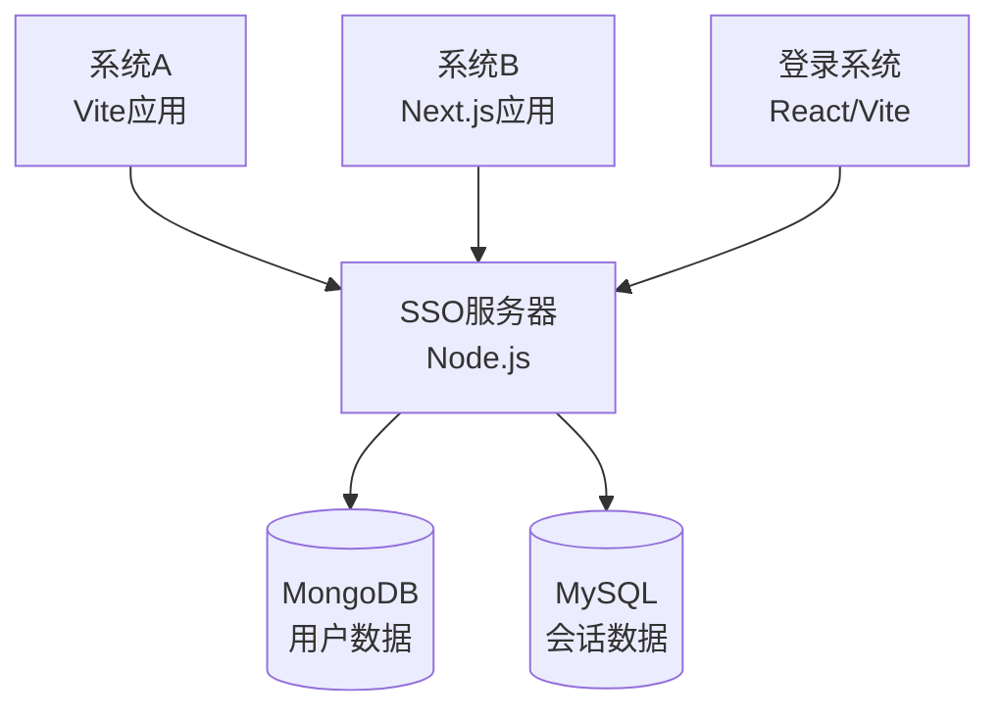

# SSO单点登录系统实现

本项目实现了一个标准的单点登录(SSO)架构，包含四个主要组件：

1. **SSO服务器** (Node.js/Express) - 中央认证服务器
2. **登录系统** (React/Vite) - 中央登录页面
3. **系统A** (React/Vite) - 需要认证的受保护应用
4. **系统B** (Next.js) - 包含公共和受保护内容的应用

## 架构概览



## 系统详情

### 1. SSO服务器 (端口 3001)
- 基于Node.js和Express构建
- 使用express-session管理用户会话
- 用户数据存储在MongoDB中
- 会话数据存储在MySQL中
- 提供认证API接口：
  - `/api/auth/login` - 用户登录
  - `/api/auth/logout` - 用户登出
  - `/api/auth/status` - 检查认证状态
  - `/api/auth/validate` - 验证令牌
  - `/api/user/:id` - 获取用户信息

### 2. 登录系统 (端口 3002)
- 基于React和Vite构建
- 所有系统的中央登录页面
- 登录成功后重定向回原始系统
- 加载时检查现有认证状态

### 3. 系统A (端口 3000)
- 基于React和Vite构建
- 完全受保护的应用 - 所有内容都需要认证
- 登录按钮重定向到SSO登录页面
- 登出按钮清除会话并重定向到登录页面

### 4. 系统B (端口 3003)
- 基于Next.js构建
- 混合应用，包含公共和受保护内容
- 公共内容无需认证即可访问
- 受保护内容需要认证
- 提供登录/登出按钮管理认证

## 启动流程

### Docker容器启动

#### 1. 启动MySQL容器
```bash
# 启动MySQL容器
docker run --name sso-mysql -e MYSQL_ROOT_PASSWORD=rootpassword -e MYSQL_DATABASE=sso_system -e MYSQL_USER=sso_user -e MYSQL_PASSWORD=sso_password -p 3306:3306 -d mysql:latest

# 验证MySQL容器运行状态
docker ps | grep sso-mysql
```

#### 2. 启动MongoDB容器
```bash
# 启动MongoDB容器
docker run --name sso-mongodb -p 27017:27017 -d mongo:latest

# 验证MongoDB容器运行状态
docker ps | grep sso-mongodb
```

### 应用系统启动

#### 1. 安装依赖
```bash
# SSO服务器
cd sso-server
npm install

# 登录系统
cd ../login-system
npm install

# 系统A
cd ../system-a
npm install

# 系统B
cd ../system-b
npm install
```

#### 2. 启动各系统
```bash
# 启动SSO服务器
cd sso-server
npm run dev

# 启动登录系统
cd ../login-system
npm run dev

# 启动系统A
cd ../system-a
npm run dev

# 启动系统B
cd ../system-b
npm run dev
```

### 启动验证

#### 1. 验证Docker容器
```bash
# 查看所有运行中的容器
docker ps

# 预期输出应包含sso-mysql和sso-mongodb容器
```

#### 2. 验证各系统端口
```bash
# 检查各系统端口是否监听
netstat -an | grep LISTEN | grep -E "(3000|3001|3002|3003)"

# 或使用lsof命令（macOS/Linux）
lsof -i :3000
lsof -i :3001
lsof -i :3002
lsof -i :3003
```

#### 3. 验证数据库连接
```bash
# 验证MySQL连接
docker exec sso-mysql mysql -u root -prootpassword -e "SHOW DATABASES;"

# 验证MongoDB连接
docker exec sso-mongodb mongosh --eval "db.adminCommand('listDatabases')"
```

#### 4. 验证Web访问
- SSO服务器: http://localhost:3001
- 登录系统: http://localhost:3002
- 系统A: http://localhost:3000
- 系统B: http://localhost:3003

## 数据导出脚本

### MongoDB数据导出
```bash
# 导出MongoDB用户数据到JSON文件
cd data-export/scripts
./export-mongo-data.sh
```

该脚本会在`data-export/exports/mongo_exports`文件夹中创建带时间戳的JSON文件，包含所有用户数据。

### MySQL数据导出
```bash
# 导出MySQL会话数据到JSON文件
cd data-export/scripts
./export-mysql-data.sh
```

该脚本会在`data-export/exports/mysql_exports`文件夹中创建带时间戳的JSON文件，包含所有会话数据。

## 使用流程

1. 访问系统A (http://localhost:3000)
   - 点击"登录"重定向到登录页面
   - 输入凭据（演示环境下任意用户名/密码）
   - 登录后重定向回系统A
   - 显示受保护内容
   - 点击"登出"清除会话并返回登录页面

2. 访问系统B (http://localhost:3003)
   - 无需认证即可查看公共内容
   - 点击"登录"进行认证
   - 登录后显示受保护内容
   - 点击"登出"清除会话

3. 跨系统认证：
   - 在任一系统登录即可认证所有系统
   - 从任一系统登出会从所有系统登出

## 核心特性

- **单点登录**: 一次登录，访问所有系统
- **会话管理**: 集中式会话处理
- **基于令牌的认证**: 安全的令牌交换
- **跨域支持**: 正确的CORS配置
- **数据库集成**: MongoDB存储用户数据，MySQL存储会话
- **响应式设计**: 移动友好的界面